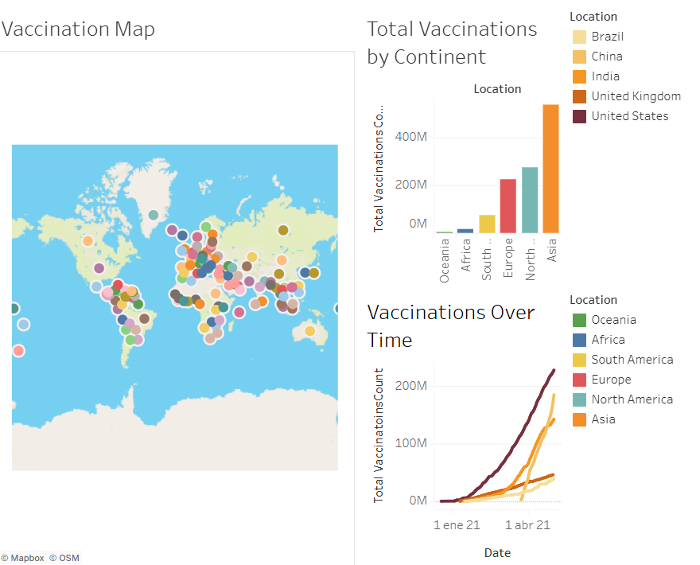
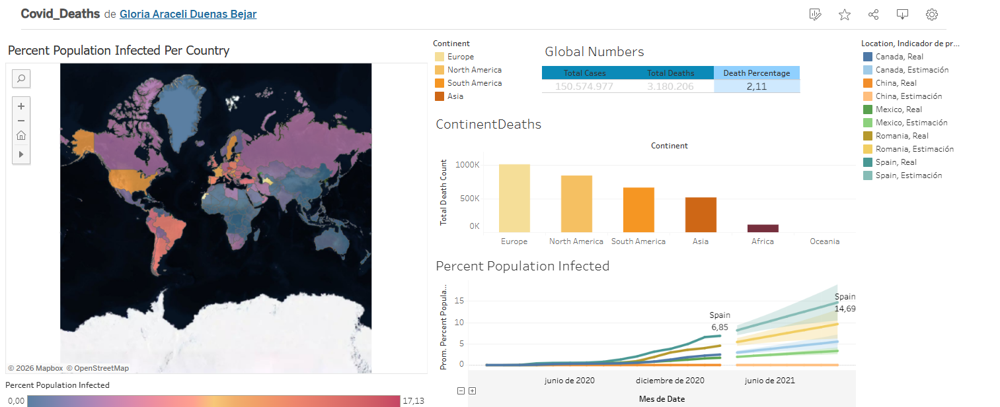

## Project Description

This project analyzes global COVID-19 data to understand how the pandemic affected different countries in terms of infections, deaths, and vaccinations.

Dataset:
https://ourworldindata.org/covid-deaths

I followed a simple workflow to explore and analyze the data:

**Excel:**

I started by exploring and cleaning the dataset in Excel. This included checking the data structure, handling missing values, and preparing it for analysis.

**SQL:**

After cleaning, I imported the data into SQL Server and wrote queries to analyze key metrics such as infection rates, death percentages, and vaccination progress.

**Tableau:**

Finally, I used the SQL queries to create interactive dashboards in Tableau, making it easier to visualize trends and compare results across countries.

**Personal Project Goals:**

The goal of this project was to practice SQL skills and transform raw data into clear, meaningful insights supported by visualizations.

https://public.tableau.com/views/Covid_Deaths_17729092228150/CovidInfectionsDeaths

## Dashboard Preview

COVID-19 Vaccinations Dashboard

COVID-19 Cases and Deaths Dashboard

Author

Araceli Bejar

GitHub: https://github.com/aracelivejar

